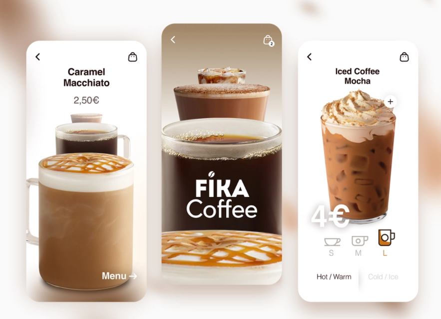

<h1><b>Coffe Concept App</b></h1>

Esta aplicacion fue realizada en **LiveCoding** a traves del canal de **Discord** [locos por flutter y dart](https://discord.gg/KkY42c7AGV), la realización de esta app fue motivo de la creación del challenge propuesto por [Diegoveloper](https://www.youtube.com/watch?v=bYqeGigTsBw&ab_channel=diegoveloper) en su canal de **Youtube**, la diferencia entre el reto propuesto por el youtuber y mi resultado es que decidí utilizar [Getx](https://pub.dev/packages/get), ademas decidí realizar algunas cosas diferente a la forma que el youtuber propuso, el código esta muy bien documentado para que puedas entender que hace cada parte de la aplicación, espero te pueda ser de utilidad.

</img>

Aqui esta el link del diseño original: [Diseño Original](https://dribbble.com/shots/14166097-Coffee-App)